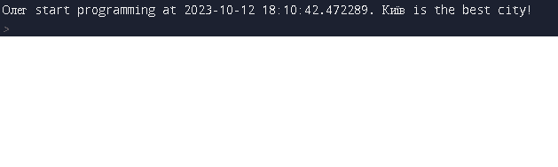

# Звіт до роботи №1
## Тема: _Оформлення робіт та перша програма_
### Мета роботи: _Навчитись оформляти роботи з використання форматування Markdown та створити першу програму на Python_
---
### Виконання роботи
- Результати виконання завдання *1...N*;
    1. [Створили файл з першою програмою `main.py`](main.py) 
    1. Програма вивела значення:   
    1. Зробили [Python Notebook `nb.ipynb`](nb.ipynb) де працювали у jupiter notebook.
    1. Навчились створювати програми у Python та працювати у jupiter notebook.

### Висновок: 
> у висновку потрібно відповісти на запитання:
- :question: Що зроблено в роботі: зроблена перша програма та її опис у notebook;
- :question: Чи досягнуто мети роботи:так!
- :question: Які нові знання отримано: вміння працювати з markdown та початкові навички з python; 
- :question: Чи вдалось відповісти на всі питання задані в ході роботи: так!
- :question: Чи вдалося виконати всі завдання: так!
- :question: Чи виникли складності у виконанні завдання: трішки незвично працювати у markdown;
- :question: Чи подобається такий формат здачі роботи (Feedback): так!
- :question: Побажання для покращення (Suggestions): немає.
---
