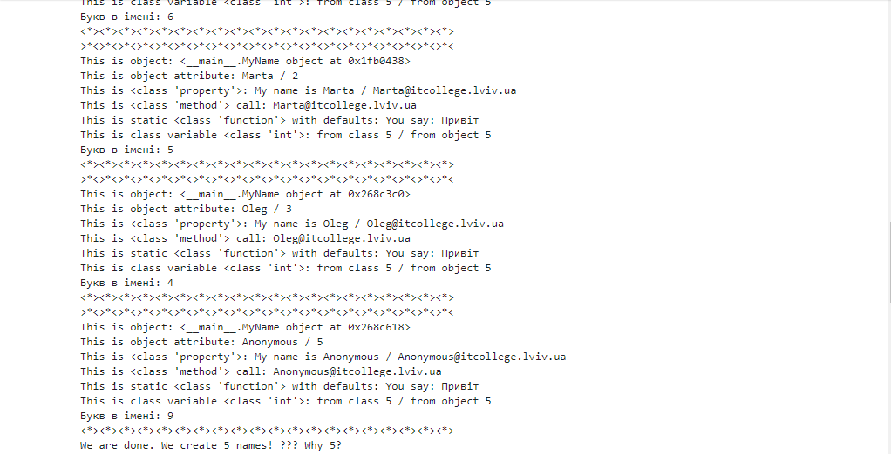

# Звіт до роботи №3
## Тема: _Знайомство з ООП_
### Мета роботи: _навчитись працювати та створювати власні класи в Python_
---
### Виконання роботи
- Результати виконання завдання:
    1. Підготували папку та файли для виконання роботи, [Python Notebook](class.ipynb);
    1. Розробили клас у Python;
    1. Програма вивела значення: 
    1. Отримані результати є в [Python Notebook](class.ipynb);
    1. Навчились працювати та створювати власні класи в Python;
    
- Відповідь на запитання:
1. Чому коли передаємо значення None створюється обєкт з іменем Anonymous?
- anonymous_user(), є @classmethod класу MyName. Цей метод створює новий об'єкт класу MyName з ім'ям "Anonymous" та повертає його. Коли передається None у конструктор класу MyName, цей метод викликається і створює об'єкт з ім'ям "Anonymous".
1. Як змінити текст привітання при виклику методу say_hello()? Допишіть цю частину коду.
- Щоб змінити текст привітання потрібно змінити функцію def say_hello і вказати свій текст
1. Допишіть функцію в класі яка порахує кількість букв і імені (підказка: використайте функцію len());
- ```def letters_numbers(self):
        if self.name:
            return len([char for char in self.name if char.isalpha()])
        else:
            return 0

  Букв в імені: {me.letters_numbers()}
```
1. Порахуйте кількість імен у списку names та порівняйте із виведеним результатом. Дайте відповідь чому маємо різну кількість імен?
- Тому що використовується метод anonymous_user() який створює об'єкт Anonymous.
### Висновок: 
- :question: Що зроблено в роботі: створено власний class
- :question: Чи досягнуто мети роботи: так
- :question: Які нові знання отримано: отримано навички роботи з class у Python
- :question: Чи вдалось відповісти на всі питання задані в ході роботи: так
- :question: Чи вдалося виконати всі завдання: так
- :question: Чи виникли складності у виконанні завдання: ні
- :question: Чи подобається такий формат здачі роботи (Feedback): так
- :question: Побажання для покращення (Suggestions): немає
---
